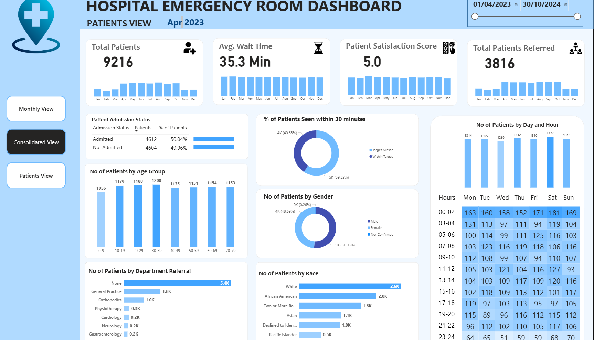
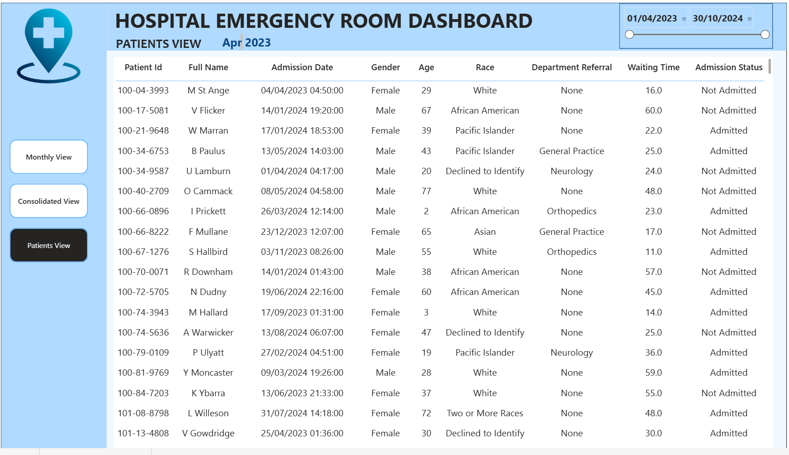

# 🏥 Hospital Emergency Room Analysis Dashboard

## 📋 Project Overview

This Power BI project delivers a comprehensive Hospital Emergency Room Analysis Dashboard designed to enhance operational efficiency and provide actionable insights into emergency room performance. The solution enables stakeholders to track, analyze, and make data-driven decisions regarding patient management and service optimization.

## 🎯 Business Requirements

### Key Performance Indicators (KPIs)

- **📊 Number of Patients**: Total daily ER visits with trend analysis
- **⏱️ Average Wait Time**: Patient waiting time before medical attention
- **😊 Patient Satisfaction Score**: Daily service quality evaluation
- **🔄 Number of Patients Referred**: Daily department referral tracking

## 📁 Dataset Information

**Source File**: `Hospital ER_Data.csv`

### Dataset Schema
| Column | Description |
|--------|-------------|
| Patient Id | Unique patient identifier |
| Patient Admission Date | Date and time of admission |
| Patient First Initial | Patient's first name initial |
| Patient Last Name | Patient's surname |
| Patient Gender | Patient gender (M/F) |
| Patient Age | Patient age in years |
| Patient Race | Patient racial/ethnic background |
| Department Referral | Referred department or "None" |
| Patient Admission Flag | Admission status (TRUE/FALSE) |
| Patient Satisfaction Score | Rating score (0-10) |
| Patient Waittime | Wait time in minutes |
| Patients CM | Case management indicator |

## 🔧 Development Process

### 1. 📋 Requirement Gathering/Business Requirements
- Defined KPIs and business objectives
- Identified stakeholder needs
- Established dashboard scope and functionality

### 2. 📊 Data Walkthrough
- Analyzed dataset structure and quality
- Identified data relationships and patterns
- Assessed data completeness and accuracy

### 3. 🔌 Data Connection
- Connected Power BI to CSV data source
- Configured data refresh settings
- Established data gateway connections

### 4. 🧹 Data Cleaning/Quality Check
- Validated data types and formats
- Handled missing values and outliers
- Ensured data consistency across fields

### 5. 🏗️ Data Modeling
- Created relationships between tables
- Designed star schema architecture
- Optimized model for performance

### 6. ⚙️ Data Processing
- Applied necessary transformations
- Created calculated columns
- Implemented data validation rules

### 7. 📐 DAX Calculations
- Developed measures and calculated columns
- Created time intelligence functions
- Implemented complex business logic

### 8. 🎨 Dashboard Layout Design
- Designed user-friendly interface
- Planned visual hierarchy and flow
- Ensured responsive design principles

### 9. 📈 Charts Development and Formatting
- Created interactive visualizations
- Applied consistent styling and branding
- Implemented drill-down capabilities

### 10. 📊 Dashboard/Report Development
- Built comprehensive reporting solution
- Integrated filtering and slicing functionality
- Tested user interactions and performance

### 11. 💡 Insights Generation
- Analyzed trends and patterns
- Identified actionable insights
- Documented key findings

## 🗓️ Calendar Table Creation

Created a dedicated calendar table for time intelligence:

```dax
_Calendar = CALENDAR(MIN('Hospital ER_Data'[Patient Admission Date]), MAX('Hospital ER_Data'[Patient Admission Date]))
```

### Calendar Columns:
- **Day Name**: `FORMAT('Hospital ER_Data'[Patient Admission Date],"ddd")`
- **Day Number**: `WEEKDAY('Hospital ER_Data'[Patient Admission Date],2)`
- **Month Name**: `FORMAT(_Calendar[Date].[Date], "mmm")`
- **Month Number**: `MONTH(_Calendar[Date])`
- **MonthYear**: `_Calendar[Month Name] & " " & _Calendar[Year]`
- **Year**: `YEAR(_Calendar[Date])`

## 📊 Key DAX Measures & Calculated Columns

### Calculated Columns

**Age Group Classification**:
```dax
Age Group = 
SWITCH(
    TRUE(),
    'Hospital ER_Data'[Patient Age] < 10 , "0-9",
    'Hospital ER_Data'[Patient Age] < 20 , "10-19",
    'Hospital ER_Data'[Patient Age] < 30 , "20-29",
    'Hospital ER_Data'[Patient Age] < 40 , "30-39",
    'Hospital ER_Data'[Patient Age] < 50 , "40-49",
    'Hospital ER_Data'[Patient Age] < 60 , "50-59",
    'Hospital ER_Data'[Patient Age] < 70 , "60-69",
    'Hospital ER_Data'[Patient Age] < 80 , "70-79",
    'Hospital ER_Data'[Patient Age] < 90 , "80-89",
    'Hospital ER_Data'[Patient Age] < 100 , "90-99",
    "100+")
```

**Time Grouping**:
```dax
Time Group = 
SWITCH(
    TRUE(),
    HOUR('Hospital ER_Data'[Patient Admitted Time]) >= 00 &&  HOUR('Hospital ER_Data'[Patient Admitted Time]) < 03, "00-02",
    HOUR('Hospital ER_Data'[Patient Admitted Time]) >= 03 &&  HOUR('Hospital ER_Data'[Patient Admitted Time]) < 05, "03-04",
    HOUR('Hospital ER_Data'[Patient Admitted Time]) >= 05 &&  HOUR('Hospital ER_Data'[Patient Admitted Time]) < 07, "05-06",
    HOUR('Hospital ER_Data'[Patient Admitted Time]) >= 07 &&  HOUR('Hospital ER_Data'[Patient Admitted Time]) < 09, "07-08",
    HOUR('Hospital ER_Data'[Patient Admitted Time]) >= 09 &&  HOUR('Hospital ER_Data'[Patient Admitted Time]) < 11, "09-10",
    HOUR('Hospital ER_Data'[Patient Admitted Time]) >= 11 &&  HOUR('Hospital ER_Data'[Patient Admitted Time]) < 13, "11-12",
    HOUR('Hospital ER_Data'[Patient Admitted Time]) >= 13 &&  HOUR('Hospital ER_Data'[Patient Admitted Time]) < 15, "13-14",
    HOUR('Hospital ER_Data'[Patient Admitted Time]) >= 15 &&  HOUR('Hospital ER_Data'[Patient Admitted Time]) < 17, "15-16",
    HOUR('Hospital ER_Data'[Patient Admitted Time]) >= 17 &&  HOUR('Hospital ER_Data'[Patient Admitted Time]) < 19, "17-18",
    HOUR('Hospital ER_Data'[Patient Admitted Time]) >= 19 &&  HOUR('Hospital ER_Data'[Patient Admitted Time]) < 21, "19-20",
    HOUR('Hospital ER_Data'[Patient Admitted Time]) >= 21 &&  HOUR('Hospital ER_Data'[Patient Admitted Time]) < 23, "21-22",
    "23-24")
```

### Key Measures

- **📊 Patient Count**: `No of Patients = DISTINCTCOUNT('Hospital ER_Data'[Patient Id])`
- **⏱️ Average Wait Time**: `Average Wait Time = FORMAT(AVERAGE('Hospital ER_Data'[Patient Waittime]), "0.0") & " Min"`
- **😊 Patient Satisfaction**: `Average Patient Satisfaction Score = FORMAT(AVERAGE('Hospital ER_Data'[Patient Satisfaction Score]), "0.0")`
- **🔄 Total Referrals**: `Total Patients Referred = CALCULATE(COUNTROWS('Hospital ER_Data'), 'Hospital ER_Data'[Department Referral] <> "None")`

## 📱 Dashboard Pages

### 1. 🗓️ Monthly View Dashboard
**Objective**: Monitor key metrics and trends on a month-by-month basis


**Features**:
- 📊 Patient Admission Status (Admitted vs. Non-admitted)
- 👥 Patient Age Distribution (10-year intervals)
- 🏥 Department Referral Analysis
- ⏰ Timeliness Metrics (30-minute target)
- 👫 Gender Distribution Analysis
- 🌍 Racial Demographics
- 📅 Time Analysis (Day/Hour patterns)

**File**: `Hospital Dashboard.pbix` - Monthly View Page

### 2. 📈 Consolidated View Dashboard
**Objective**: Holistic summary of hospital performance for customizable date ranges



**Features**:
- 📊 Aggregated metrics across selected periods
- 📈 Trend analysis with customizable timeframes
- 🔍 Comparative performance insights
- 📋 Executive summary metrics

**File**: `Hospital Dashboard.pbix` - Consolidated View Page

### 3. 👤 Patient Details Dashboard
**Objective**: Granular patient-level data for detailed analysis



**Features**:
- 🆔 Patient ID
- 👤 Patient Full Name
- 👫 Gender
- 📅 Age
- 📆 Admission Date
- 🌍 Patient Race
- ⏱️ Wait Time
- 🏥 Department Referral
- ✅ Admission Status

**File**: `Hospital Dashboard.pbix` - Patient Details Page

## 🚀 How to Use

1. **Open Dashboard**: Launch `Hospital Dashboard.pbix` in Power BI Desktop
2. **Navigate Pages**: Use the navigation tabs to switch between dashboards
3. **Apply Filters**: Utilize date ranges and category filters
4. **Interact**: Click on visuals for drill-down capabilities
5. **Export**: Generate reports and export data as needed

## 🔧 Technical Requirements

- **Power BI Desktop**: Latest version recommended
- **Data Source**: CSV file compatibility
- **Memory**: Minimum 8GB RAM for optimal performance
- **Storage**: 100MB+ available disk space

## 📊 Key Insights & Outcomes

- **Operational Efficiency**: Improved patient flow management
- **Resource Optimization**: Better department staffing decisions
- **Patient Experience**: Enhanced satisfaction monitoring
- **Performance Tracking**: Real-time KPI monitoring
- **Data-Driven Decisions**: Evidence-based operational improvements

## 🔄 Data Refresh

The dashboard is configured to refresh data automatically when the source CSV file is updated. For real-time updates, consider implementing:
- **Scheduled Refresh**: Set up automated data refresh cycles
- **Data Gateway**: Configure for enterprise data sources
- **Real-time Streaming**: For live data integration

## 📞 Support & Maintenance

For questions, issues, or enhancement requests:
- 📧 Contact: [LinkedIn](https://www.linkedin.com/in/codewithzaki/)
- 📋 Documentation: This README file
- 🔄 Updates: Regular dashboard maintenance schedule

---

**Project Status**: ✅ Complete  
**Last Updated**: July 2025  
**Version**: 1.0  
**Created By**: Eng.Omar  
**Tool Used**: Microsoft Power BI Desktop