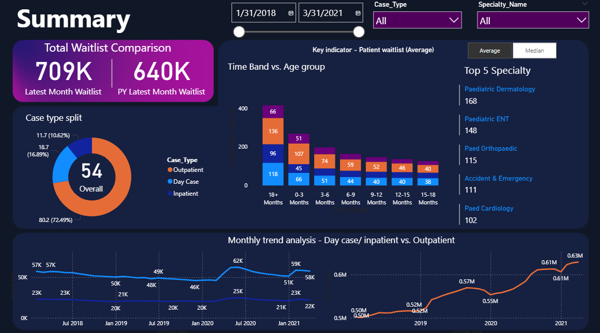

# 🏥 Healthcare Waitlist Analysis Dashboard



## 📋 Project Overview

This Power BI project presents a comprehensive Healthcare Waitlist Analysis Dashboard that combines inpatient and outpatient datasets to provide actionable insights into patient waiting times across different specialties and demographics. The dashboard addresses key healthcare management requirements through dynamic visualizations and interactive analytics.

---

## 🎯 Business Requirements

Based on the project requirements, this dashboard addresses critical healthcare analytics needs:

- **📊 Patient Waitlist Monitoring**: Track current waitlist volumes across specialties
- **📈 Trend Analysis**: Monitor waitlist changes over time periods
- **🏥 Specialty Comparison**: Compare performance across different medical specialties
- **👥 Demographic Analysis**: Analyze waitlist patterns by age groups and patient types
- **⏱️ Time Band Analysis**: Evaluate waiting times across different time periods
- **🔄 Dynamic Calculations**: Switch between average and median calculations for flexible analysis

---

## 📁 Dataset Information

### Data Sources
- **Inpatient Dataset**: Located in `Datasets/Inpatient/`
- **Outpatient Dataset**: Located in `Datasets/Outpatient/`
- **Specialty Mapping**: `Datasets/Mapping_Specialty.csv`

### Data Schema
| Column | Description |
|--------|-------------|
| Archive_Date | Date of data collection/archival |
| Specialty_HIPE | HIPE specialty code identifier |
| Specialty_Name | Full name of medical specialty |
| Case_Type | Type of medical case (Inpatient/Outpatient) |
| Adult_Child | Patient age category (Adult/Child) |
| Age_Profile | Detailed age group classification |
| Time_Bands | Waiting time duration categories |
| Total | Total number of patients in waitlist |

---

## 🔧 Data Processing & Modeling

### Data Integration
- **Data Append**: Combined inpatient and outpatient datasets into unified analysis table
- **Data Cleansing**: Standardized data formats and handled missing values
- **Relationship Modeling**: Established connections between main dataset and specialty mapping

### Data Transformation
- Consolidated multiple data sources into single `All_Data` table
- Implemented specialty mapping for enhanced readability
- Created calculation parameters for dynamic measure switching

---

## 📊 Key DAX Measures

### Core Measures

**Average Waitlist Calculation**:
```dax
Average Waitlist = AVERAGE(All_Data[Total])
```

**Dynamic Average/Median Switcher**:
```dax
Avg/Median wait list = SWITCH(
    VALUES('Calculation Table'[Calculate Method]),
    "Average", [Average Waitlist], 
    "Median", [Median Waitlist]
)
```

**Current Year Latest Patients**:
```dax
CY Latest Patients = CALCULATE(
    SUM(All_Data[Total]),
    All_Data[Archive_Date] = MAX(All_Data[Archive_Date])
) + 0
```

**Dynamic Title Generation**:
```dax
Dynamic title = SWITCH(
    VALUES('Calculation Table'[Calculate Method]),
    "Average", "Key indicator - Patient waitlist (Average)", 
    "Median", "Key indicator - Patient waitlist (Median)"
)
```

**Previous Year Comparison**:
```dax
PY Latest Month Waitlist = CALCULATE(
    SUM(All_Data[Total]),
    All_Data[Archive_Date] = EDATE(MAX(All_Data[Archive_Date]), -12)
) + 0
```

---

## 🎨 Dashboard Features

### Interactive Components
- **📊 Dynamic Calculations**: Toggle between Average and Median views
- **📅 Time Period Analysis**: Compare current vs. previous year performance
- **🏥 Specialty Filtering**: Drill down by medical specialties
- **👥 Demographic Segmentation**: Filter by Adult/Child and detailed age profiles
- **⏰ Time Band Analysis**: Analyze waiting time distributions

### Key Visualizations
- **📈 Trend Charts**: Historical waitlist patterns over time
- **📊 Specialty Comparison**: Performance metrics across medical departments
- **🎯 KPI Cards**: Key performance indicators with dynamic titles
- **📋 Detailed Tables**: Granular data exploration capabilities
- **🔍 Interactive Filters**: Multi-dimensional data slicing and dicing

---

## 📈 Key Insights & Analysis

### Performance Metrics
- **Current Waitlist Volume**: Real-time patient waiting numbers
- **Year-over-Year Comparison**: Trend analysis for performance evaluation
- **Specialty Performance**: Identification of high-volume specialties
- **Demographic Patterns**: Age-based waitlist distribution analysis
- **Time Band Distribution**: Understanding of waiting time patterns

### Analytical Capabilities
- **Flexible Calculation Methods**: Switch between statistical measures
- **Temporal Analysis**: Multi-period comparison functionality
- **Segmentation Analysis**: Detailed breakdown by multiple dimensions
- **Performance Benchmarking**: Comparative analysis across categories

---

## 🚀 Technical Implementation

### Tools & Technologies
- **Power BI Desktop**: Primary development platform
- **DAX**: Advanced calculations and measures
- **Power Query**: Data transformation and integration
- **Data Modeling**: Star schema implementation

### File Structure
```
PROJECT 3/
├── HealthCare.pbix          # Main Power BI dashboard file
├── Datasets/
│   ├── Inpatient/           # Inpatient dataset files
│   ├── Outpatient/          # Outpatient dataset files
│   └── Mapping_Specialty.csv # Specialty mapping reference
├── Background/              # Project requirement documentation
│   ├── Slide1.PNG
│   ├── Slide2.PNG
│   └── Slide3.PNG
└── README.md               # This documentation file
```

---

## 🔄 How to Use

1. **Open Dashboard**: Launch `HealthCare.pbix` in Power BI Desktop
2. **Select Calculation Method**: Use the slicer to switch between Average/Median
3. **Apply Filters**: Filter by specialty, age group, or time period
4. **Analyze Trends**: Review historical patterns and current performance
5. **Export Reports**: Generate insights and export data as needed

---

## 📊 Skills Demonstrated

- **Data Integration**: Combining multiple healthcare datasets
- **Advanced DAX**: Complex measures with dynamic switching logic
- **Healthcare Analytics**: Domain-specific KPI development
- **Interactive Design**: User-friendly dashboard with dynamic components
- **Performance Optimization**: Efficient data modeling and calculations
- **Business Intelligence**: Translating requirements into actionable insights

---

## 🎯 Business Impact

### Operational Benefits
- **Resource Planning**: Better allocation of healthcare resources
- **Performance Monitoring**: Real-time tracking of waitlist metrics
- **Trend Analysis**: Historical patterns for strategic planning
- **Specialty Insights**: Department-specific performance evaluation
- **Data-Driven Decisions**: Evidence-based healthcare management

### Strategic Value
- **Capacity Management**: Optimize patient flow and resource utilization
- **Quality Improvement**: Monitor and enhance patient experience
- **Benchmarking**: Compare performance across different dimensions
- **Forecasting**: Predict future waitlist trends and requirements

---

## 📞 Contact & Support

For questions, feedback, or collaboration opportunities:

- **LinkedIn**: [Connect with me](https://www.linkedin.com/in/codewithzaki/)
- **GitHub**: [View Repository](https://github.com/CODEwithZAKI2/Power-BI-for-Data-Analystics)
- **Email**: Available upon request

---

**Project Status**: ✅ Complete  
**Last Updated**: July 2025  
**Version**: 1.0  
**Created By**: CODEwithZAKI2  
**Tool Used**: Microsoft Power BI Desktop

---

*This dashboard demonstrates advanced Power BI capabilities in healthcare analytics, combining multiple datasets to deliver comprehensive waitlist management insights.*