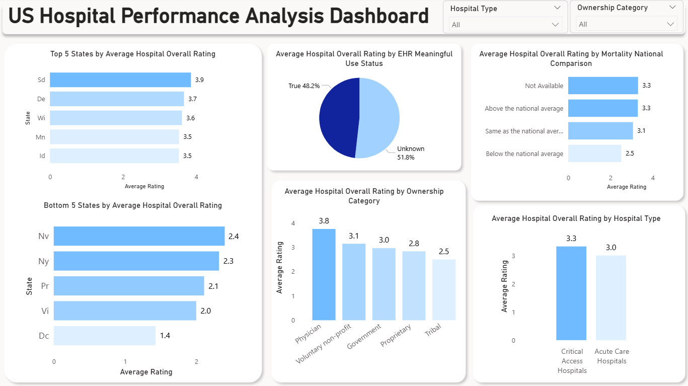
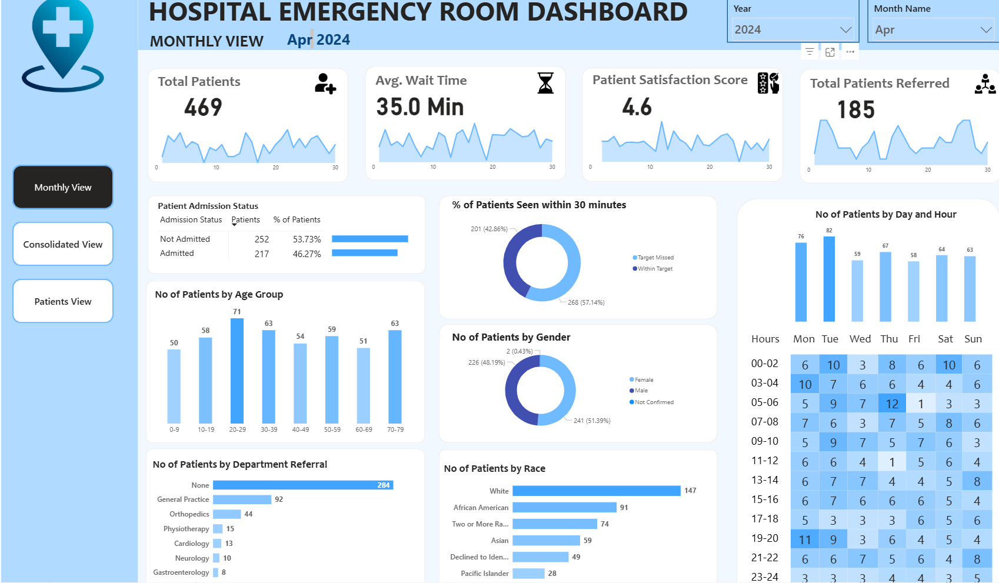

# 📊 Power BI for Data Analytics - Portfolio

Welcome to my Power BI analytics portfolio! This repository showcases various data analysis projects demonstrating advanced Power BI skills, including data cleaning, transformation, DAX measures, and interactive dashboard creation.

---

## 📁 Projects Overview

### 🏥 PROJECT 1: US Hospital Performance Analysis Dashboard

**Overview:** Comprehensive analysis of US hospital performance using Medicare Hospital General Information dataset, focusing on overall ratings and key quality metrics across different states, ownership types, and hospital categories.

**Key Features:**
- Advanced Power Query data cleaning and transformation
- Custom DAX measures for performance analytics
- Interactive visualizations answering 5 critical business questions
- Professional dashboard design with actionable insights

**Technologies Used:** Power BI, Power Query, DAX, Data Visualization

**Dataset:** Medicare Hospital General Information (4,800+ hospitals)

**Key Insights:**
- State-level performance variations (SD, DE, WI leading; NV, NY, PR lagging)
- Physician-owned hospitals achieve highest ratings
- Critical Access Hospitals outperform Acute Care facilities
- EHR implementation impact on hospital performance

**Skills Demonstrated:**
- **Data Cleaning & Transformation:** Power Query for complex data preparation
- **Advanced Analytics:** DAX measures and calculated columns
- **Data Visualization:** Interactive dashboards and storytelling
- **Business Intelligence:** Answering real-world healthcare questions
- **Professional Presentation:** Clean, modern dashboard design

📂 **[➡️ Go to Project 1](./PROJECT%201/)**

---

### 🏥 PROJECT 2: Hospital Emergency Room Analysis Dashboard

**Overview:** Comprehensive Hospital Emergency Room Analysis Dashboard designed to enhance operational efficiency and provide actionable insights into emergency room performance. Enables stakeholders to track, analyze, and make data-driven decisions regarding patient management and service optimization.

**Key Features:**
- Complete 11-step development process from requirement gathering to insights generation
- Three specialized dashboard pages (Monthly View, Consolidated View, Patient Details)
- Real-time KPI monitoring and trend analysis
- Advanced DAX calculations for time intelligence and patient classification
- Interactive visualizations with drill-down capabilities

**Technologies Used:** Power BI Desktop, DAX, Power Query, Calendar Tables, Star Schema

**Dataset:** Hospital ER_Data.csv (Patient admissions, demographics, wait times, satisfaction scores)

**Key Insights:**
- Patient flow optimization through admission status tracking
- Age group and demographic analysis for resource planning
- Department referral patterns and wait time optimization
- Time-based analysis for staffing decisions
- Patient satisfaction correlation with operational metrics

**Skills Demonstrated:**
- **Data Modeling:** Star schema architecture and relationship management
- **Time Intelligence:** Calendar table creation and time-based calculations
- **Advanced DAX:** Complex measures, calculated columns, and SWITCH functions
- **Dashboard Design:** Multi-page responsive layouts with navigation
- **Business Intelligence:** KPI development and performance tracking

📂 **[➡️ Go to Project 2](./PROJECT%202/)**

---

## 📞 Contact

For questions, collaboration opportunities, or to discuss these projects, feel free to connect:

- **LinkedIn:** [Connect with me](https://www.linkedin.com/codewithzaki)
- **Email:** Available upon request

---

*This portfolio is continuously updated with new Power BI projects and advanced analytics demonstrations.*