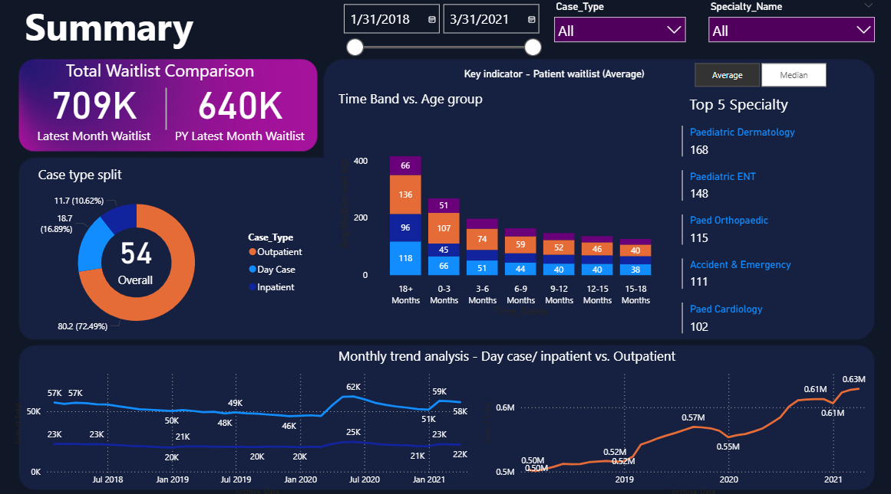

# 📊 Power BI for Data Analytics - Portfolio

Welcome to my Power BI analytics portfolio! This repository showcases various data analysis projects demonstrating advanced Power BI skills, including data cleaning, transformation, DAX measures, and interactive dashboard creation.

---

## 📁 Projects Overview

### 🏥 PROJECT 1: US Hospital Performance Analysis Dashboard

**Overview:** Comprehensive analysis of US hospital performance using Medicare Hospital General Information dataset, focusing on overall ratings and key quality metrics across different states, ownership types, and hospital categories.

**Key Features:**
- Advanced Power Query data cleaning and transformation
- Custom DAX measures for performance analytics
- Interactive visualizations answering 5 critical business questions
- Professional dashboard design with actionable insights

**Technologies Used:** Power BI, Power Query, DAX, Data Visualization

**Dataset:** Medicare Hospital General Information (4,800+ hospitals)

**Key Insights:**
- State-level performance variations (SD, DE, WI leading; NV, NY, PR lagging)
- Physician-owned hospitals achieve highest ratings
- Critical Access Hospitals outperform Acute Care facilities
- EHR implementation impact on hospital performance

**Skills Demonstrated:**
- **Data Cleaning & Transformation:** Power Query for complex data preparation
- **Advanced Analytics:** DAX measures and calculated columns
- **Data Visualization:** Interactive dashboards and storytelling
- **Business Intelligence:** Answering real-world healthcare questions
- **Professional Presentation:** Clean, modern dashboard design

📂 **[➡️ Go to Project 1](./PROJECT%201/)**

---

### 🏥 PROJECT 2: Hospital Emergency Room Analysis Dashboard

**Overview:** Comprehensive Hospital Emergency Room Analysis Dashboard designed to enhance operational efficiency and provide actionable insights into emergency room performance. Enables stakeholders to track, analyze, and make data-driven decisions regarding patient management and service optimization.

**Key Features:**
- Complete 11-step development process from requirement gathering to insights generation
- Three specialized dashboard pages (Monthly View, Consolidated View, Patient Details)
- Real-time KPI monitoring and trend analysis
- Advanced DAX calculations for time intelligence and patient classification
- Interactive visualizations with drill-down capabilities

**Technologies Used:** Power BI Desktop, DAX, Power Query, Calendar Tables, Star Schema

**Dataset:** Hospital ER_Data.csv (Patient admissions, demographics, wait times, satisfaction scores)

**Key Insights:**
- Patient flow optimization through admission status tracking
- Age group and demographic analysis for resource planning
- Department referral patterns and wait time optimization
- Time-based analysis for staffing decisions
- Patient satisfaction correlation with operational metrics

**Skills Demonstrated:**
- **Data Modeling:** Star schema architecture and relationship management
- **Time Intelligence:** Calendar table creation and time-based calculations
- **Advanced DAX:** Complex measures, calculated columns, and SWITCH functions
- **Dashboard Design:** Multi-page responsive layouts with navigation
- **Business Intelligence:** KPI development and performance tracking

📂 **[➡️ Go to Project 2](./PROJECT%202/)**

---

### 🏥 PROJECT 3: Healthcare Waitlist Analysis Dashboard

**Overview:** Comprehensive Healthcare Waitlist Analysis Dashboard that combines inpatient and outpatient datasets to provide actionable insights into patient waiting times across different specialties and demographics. Features dynamic visualizations and interactive analytics for healthcare management optimization.

**Key Features:**
- Data integration combining inpatient and outpatient datasets
- Dynamic calculation switching between Average and Median methods
- Interactive dashboard with specialty, demographic, and time-based filtering
- Advanced DAX measures for flexible analytical capabilities
- Real-time KPI monitoring and year-over-year comparison functionality

**Technologies Used:** Power BI Desktop, DAX, Power Query, Data Modeling, Star Schema

**Dataset:** Combined healthcare datasets (Inpatient/Outpatient) with specialty mapping and demographic segmentation

**Key Insights:**
- Real-time patient waitlist volume tracking across specialties
- Year-over-year performance comparison and trend analysis
- Specialty-specific performance identification and benchmarking
- Age-based demographic patterns in waitlist distribution
- Time band analysis for waiting time optimization

**Skills Demonstrated:**
- **Data Integration:** Combining multiple healthcare datasets with advanced append operations
- **Advanced DAX:** Complex measures with dynamic switching logic and time intelligence
- **Healthcare Analytics:** Domain-specific KPI development and performance tracking
- **Interactive Design:** User-friendly dashboard with dynamic calculation methods
- **Performance Optimization:** Efficient data modeling and star schema implementation

📂 **[➡️ Go to Project 3](./PROJECT%203/)**

---

## 📞 Contact

For questions, collaboration opportunities, or to discuss these projects, feel free to connect:

- **LinkedIn:** [Connect with me](https://www.linkedin.com/codewithzaki)
- **Email:** Available upon request

---

*This portfolio is continuously updated with new Power BI projects and advanced analytics demonstrations.*